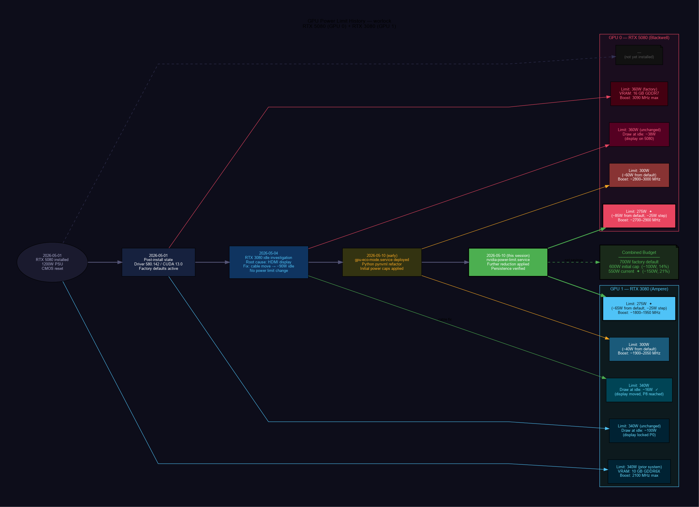
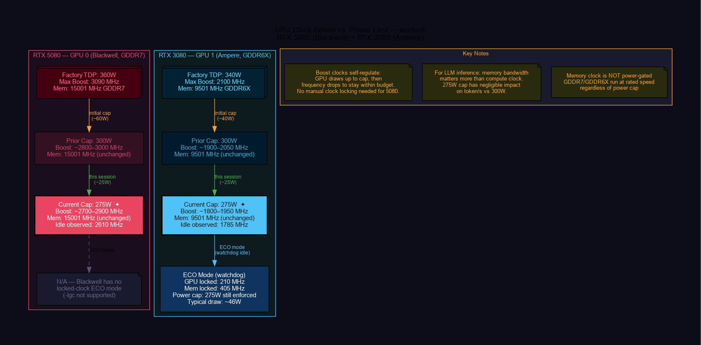

<p align="center">
  
</p>

<h1 align="center">gpu-thermal-worlock</h1>

<p align="center">
  Dual-GPU thermal management for the <strong>worlock</strong> machine.<br/>
  RTX 5080 (Blackwell) + RTX 3080 (Ampere) — power caps, clock behavior, watchdog, and systemd persistence.
</p>

<p align="center">
  
  
  
  
  
  
  
  
  
</p>

---

## Changelog

| Date | Change |
|------|--------|
| **2026-05-10** | **Reduced power limits 300W → 275W** on both GPUs via `nvidia-power-limit.service`; updated TOML config; added `arch_clock_vs_power` and `arch_power_limit_history` diagrams; verbose README rewrite |
| **2026-05-10** | Refactored bash scripts → Python 3 + pynvml typed package; `gpu-eco-mode.service` + `gpu-watchdog.service` deployed |
| **2026-05-10** | RTX 5080 (Blackwell, 16 GB GDDR7) installed alongside existing RTX 3080; initial 300W caps applied; session logging established |
| **2026-05-04** | RTX 3080 idle power investigation — root cause identified (HDMI display forcing P0 state); fix: cable moved to RTX 5080; −90W idle savings |
| **2026-05-01** | RTX 5080 + 1200W PSU hardware install; CMOS reset; driver 580.142 / CUDA 13.0 confirmed; dual-GPU VRAM = 25.9 GiB for Ollama |

---

## Overview

**worlock** is an AMD Ryzen 9 5950X workstation running local LLM inference (Ollama) 24/7 with two NVIDIA GPUs in a tensor-split configuration. The machine is never idle — it serves LLM requests continuously, making thermal management critical rather than optional.

### Why this repo exists

Running dual high-end GPUs under sustained inference load raises three problems this codebase addresses:

1. **Power delivery** — Two GPUs at factory TDP (360W + 340W = 700W) stress the PSU and generate heat. Capping them reduces temperatures, noise, and electricity consumption with negligible inference impact.
2. **Persistence** — `nvidia-smi -pl` settings evaporate on every reboot. A one-shot systemd service is the correct pattern to restore them at boot.
3. **Architectural differences** — Blackwell (RTX 5080) and Ampere (RTX 3080) support different thermal control knobs. Blackwell has no `-gtt` (GPU target temperature) support; Ampere supports full clock locking (`-lgc`, `-lmc`) and temperature targeting. The code handles both explicitly.

### Implementation approach

The codebase is written in **Python 3 + pynvml**, binding directly to `libnvidia-ml.so` — the same shared library that `nvidia-smi` calls internally. This eliminates all subprocess forks from the hot polling path and gives typed `NVMLError` exceptions instead of silent failures.

---

## System Architecture

<p align="center">
  
</p>

> Full diagram: [SVG](docs/arch_system_overview.svg) · [DOT source](docs/arch_system_overview.dot)

The system has four layers:

- **Hardware** — CPU (Ryzen 9 5950X), 96 GB DDR4, PCIe Gen4 bifurcated x8/x8, two NVIDIA GPUs
- **NVIDIA driver stack** — `nvidia-persistenced` keeps GPU driver state alive; `nvidia-smi` is the control interface
- **Thermal management** (this repo) — `gpu-eco-mode.service` (boot) + `gpu-watchdog.service` (runtime) enforce power caps and clock limits
- **Workloads** — Ollama (LLM inference, tensor-split across both GPUs), OpenWebUI (Docker, port 3000)

---

## Hardware

| Slot | GPU | Architecture | VRAM | Factory TDP | Power Range |
|------|-----|-------------|------|-------------|-------------|
| GPU 0 | NVIDIA RTX 5080 | Blackwell | 16 GB GDDR7 | 360 W | 250–400 W |
| GPU 1 | NVIDIA RTX 3080 | Ampere | 10 GB GDDR6X | 340 W | 100–375 W |

**Driver:** 580.142 · **CUDA:** 13.0 · **nvidia-persistenced:** enabled  
**Combined VRAM for Ollama:** ~25.9 GiB (tensor-split via `CUDA_VISIBLE_DEVICES=0,1`)  
**PCIe:** Gen4 x8/x8 bifurcation (Ryzen 5950X splits its 16 CPU lanes between both slots — expected and correct)

---

## Power Limit History

<p align="center">
  
</p>

> Full diagram: [SVG](docs/arch_power_limit_history.svg) · [DOT source](docs/arch_power_limit_history.dot)

The power limits have evolved through three distinct phases:

1. **Factory defaults (2026-05-01):** RTX 5080 at 360W, RTX 3080 at 340W = 700W combined. RTX 3080 was also drawing 100W at idle due to an HDMI display forcing P0 state with GDDR6X memory locked at max frequency.
2. **Initial caps (2026-05-10 early):** `gpu-eco-mode.service` applied 300W caps to both GPUs. Combined budget: 600W (−100W, 14% reduction from factory).
3. **Current caps (2026-05-10, this session):** `nvidia-power-limit.service` further reduced both to 275W. Combined budget: **550W (−150W, 21% reduction from factory)**.

---

## Thermal Configuration

| Setting | RTX 5080 (GPU 0) | RTX 3080 (GPU 1) |
|---------|-----------------|-----------------|
| Target Temp (`-gtt`) | **Not supported** (Blackwell) | **70°C** (range 65–91°C) |
| Power cap — eco mode | **275 W** | **275 W** |
| Power cap — perf mode | **275 W** | **275 W** |
| Clock control — eco | N/A (Blackwell) | Locked: 210 MHz GPU / 405 MHz Mem |
| Clock control — perf | Auto (power-gated) | Auto |
| Boot persistence | `nvidia-power-limit.service` | `nvidia-power-limit.service` |
| Max Operating Temp | N/A (T.Limit offsets) | 93°C |
| Slowdown threshold | T.Limit −2°C offset | 95°C |
| Shutdown threshold | T.Limit −5°C offset | 98°C |
| Margin to slowdown | N/A | **25°C** |

All tunable values live in **`gpu_thermal.toml`** — no code changes needed to adjust power limits or temperatures.

### Power Savings

<p align="center">
  
</p>

> Full diagram: [SVG](docs/arch_power_budget.svg) · [DOT source](docs/arch_power_budget.dot)

| GPU | Factory Default | Current Cap | Saved | Reduction |
|-----|----------------|-------------|-------|-----------|
| RTX 5080 | 360 W | **275 W** | 85 W | 24% |
| RTX 3080 | 340 W | **275 W** | 65 W | 19% |
| **Total** | **700 W** | **550 W** | **150 W** | **21%** |

At 24/7 operation: 150W × 8760h = **1,314 kWh/year** saved versus running at factory TDP.

---

## Thermal Control Flow

<p align="center">
  
</p>

> Full diagram: [SVG](docs/arch_thermal_control_flow.svg) · [DOT source](docs/arch_thermal_control_flow.dot)

At boot, `nvidia-persistenced` starts first (it keeps GPU driver contexts alive across application lifecycle). Once it is active, `gpu-eco-mode.service` fires as a oneshot — applying persistence mode, power caps (275W), and RTX 3080 clock locks (210/405 MHz) via the Python CLI. The `gpu-watchdog.service` daemon then starts and polls GPU 1 every 10 seconds, switching between ECO and PERF modes based on utilization. The 275W cap is enforced in both modes — the watchdog can only control clock speed, not lift the power ceiling.

---

## Watchdog State Machine

The `gpu-watchdog` daemon monitors GPU 1 (RTX 3080) utilization every 10 seconds and automatically switches between eco and perf modes.

<p align="center">
  
</p>

> Full diagram: [SVG](docs/arch_watchdog_state_machine.svg) · [DOT source](docs/arch_watchdog_state_machine.dot)

| State | Trigger | RTX 3080 Clocks | Both GPUs Power Cap |
|-------|---------|----------------|---------------------|
| **ECO** | Boot default / 60s idle | Locked 210 MHz GPU / 405 MHz Mem | **275 W** |
| **PERF** | Any load > 2% util | Auto (up to ~1800–1950 MHz) | **275 W** |

The 275W cap is enforced in **both** modes — the watchdog toggles clocks, not power limits. An Ollama inference job triggers the PERF switch instantly (any compute process on GPU 1 counts as load > 0); 60 consecutive seconds of zero utilization returns it to ECO.

GPU 0 (RTX 5080) is not clock-limited in either mode since Blackwell has no `-lgc` support. Its power cap alone keeps temperatures in check.

---

## systemd Service Dependencies

<p align="center">
  
</p>

> Full diagram: [SVG](docs/arch_service_dependencies.svg) · [DOT source](docs/arch_service_dependencies.dot)

| Service | Type | Role |
|---------|------|------|
| `nvidia-persistenced` | daemon | Keeps GPU driver state alive across app lifecycle |
| `nvidia-power-limit.service` | oneshot | Sets 275W cap on both GPUs at boot (belt-and-suspenders) |
| `gpu-eco-mode.service` | oneshot | Applies full thermal settings at boot via Python CLI |
| `gpu-watchdog.service` | daemon | Load-based eco/perf switching via Python daemon |
| `ollama.service` | daemon | LLM inference on both GPUs |

The `nvidia-power-limit.service` was added as a lightweight safety net — it runs before the full Python stack and ensures both GPUs are capped at 275W even if `gpu-eco-mode.service` fails.

---

## Clock Speed Behavior at 275W

<p align="center">
  
</p>

> Full diagram: [SVG](docs/arch_clock_vs_power.svg) · [DOT source](docs/arch_clock_vs_power.dot)

| GPU | Max Boost | At 275W (idle) | At 275W (inference est.) | Mem Clock |
|-----|-----------|---------------|--------------------------|-----------|
| RTX 5080 (Blackwell) | 3090 MHz | 2610 MHz | ~2700–2900 MHz | 15001 MHz GDDR7 |
| RTX 3080 (Ampere) | 2100 MHz | 1785 MHz | ~1800–1950 MHz | 9501 MHz GDDR6X |
| RTX 3080 — ECO mode | — | 210 MHz (locked) | 210 MHz (locked) | 405 MHz (locked) |

**Key points:**

- **Memory clock is not power-gated.** GDDR7 and GDDR6X run on a separate power rail and remain at rated frequency regardless of the power cap. The memory bus is always at full bandwidth.
- **Compute clock self-regulates.** The GPU boosts as high as the power budget allows, then throttles frequency to stay within the 275W ceiling. No manual clock locking is needed for the RTX 5080.
- **For LLM inference, memory bandwidth dominates.** Weight loading from VRAM is the bottleneck in autoregressive decoding, not GPU compute frequency. A 5–8% reduction in sustained boost clock (from 3090 MHz at 360W to ~2800 MHz at 275W) has negligible impact on tokens/second.
- **RTX 3080 ECO mode** locks clocks drastically (210 MHz / 405 MHz) to minimize idle power draw. This is only active when Ollama is not running — the watchdog immediately switches to PERF mode on any compute load.

---

## Implementation — Python 3 + pynvml

The codebase was refactored from bash scripts to a typed Python package backed by `nvidia-ml-py` (official NVIDIA pynvml bindings). This eliminates all `sudo nvidia-smi` subprocess forks from the polling loop.

### Why Python + pynvml

| Criterion | Python + pynvml | Bash scripts (before) |
|-----------|----------------|----------------------|
| GPU control | Direct `libnvidia-ml.so` binding | `sudo nvidia-smi` subprocess per call |
| Polling overhead | Zero process forks | 2 subprocess forks × 6/min |
| Error handling | Typed `NVMLError` exceptions | Silent failures |
| Config | `gpu_thermal.toml` | Hardcoded variables |
| Logging | Structured journal output | `echo` to stdout |
| Shutdown | SIGTERM → eco + clean exit | `kill` |
| Config reload | SIGHUP (no restart needed) | Service restart |
| Temp alerting | Built into poll loop | None |

### Package Structure

```
gpu-thermal-worlock/
├── gpu_thermal/
│   ├── __init__.py
│   ├── config.py        # Dataclass config loaded from gpu_thermal.toml
│   ├── nvml.py          # pynvml wrapper — all GPU queries and control ops
│   ├── modes.py         # eco/perf mode application logic
│   ├── cli.py           # Oneshot CLI (replaces gpu_power_toggle.sh)
│   └── watchdog.py      # State machine daemon (replaces gpu_watchdog.sh)
├── gpu_thermal.toml     # All tunable parameters — edit here, not in code
├── requirements.txt
├── pyproject.toml
├── scripts/legacy/      # Original bash scripts (archived)
├── systemd/
│   ├── gpu-eco-mode.service
│   └── gpu-watchdog.service
└── docs/                # Session logs, diagrams, how-to guides
```

### Configuration (`gpu_thermal.toml`)

```toml
[gpu.rtx5080]
id = 0
name = "RTX 5080 (Blackwell)"
power_eco = 275
power_perf = 275
gtt_supported = false

[gpu.rtx3080]
id = 1
name = "RTX 3080 (Ampere)"
power_eco = 275
power_perf = 275
target_temp = 70
clock_mem_eco = 405
clock_gpu_eco = 210
gtt_supported = true

[watchdog]
poll_interval = 10
idle_threshold_pct = 2
idle_cycles_before_eco = 6

[alerting]
enabled = false
temp_warn_celsius = 80
webhook_url = ""
```

### Install

```bash
# Install dependencies (as root for systemd service use)
sudo pip3 install nvidia-ml-py sdnotify tomli

# Deploy service files
sudo cp systemd/gpu-eco-mode.service /etc/systemd/system/
sudo cp systemd/gpu-watchdog.service /etc/systemd/system/
sudo systemctl daemon-reload
sudo systemctl restart gpu-eco-mode.service gpu-watchdog.service
```

---

## Persistence Strategy

GPU power limits set by `nvidia-smi -pl` are **volatile** — they reset to factory defaults on every reboot or driver reload. This repo uses a two-layer persistence strategy:

### Layer 1 — `nvidia-power-limit.service` (lightweight safety net)

```ini
[Unit]
Description=NVIDIA GPU power limit enforcement (RTX5080=275W, RTX3080=275W)
After=multi-user.target
After=nvidia-persistenced.service

[Service]
Type=oneshot
RemainAfterExit=yes
ExecStart=/bin/bash -c 'nvidia-smi -i 0 -pl 275 && nvidia-smi -i 1 -pl 275'

[Install]
WantedBy=multi-user.target
```

This runs early in the boot sequence and applies the 275W cap directly via `nvidia-smi`. It is intentionally minimal — no Python, no config file, no dependencies. If the full Python stack fails, the caps are still applied.

### Layer 2 — `gpu-eco-mode.service` (full thermal setup)

Runs after `nvidia-power-limit.service` and applies the complete thermal configuration: power caps, persistence mode, RTX 3080 clock locks, and temperature targets. Calls the Python package (`gpu_thermal.cli eco`).

### What happens on reboot

1. `nvidia-persistenced` starts → GPU driver contexts stay alive
2. `nvidia-power-limit.service` → 275W on both GPUs (fast, no-deps)
3. `gpu-eco-mode.service` → full eco settings via pynvml
4. `gpu-watchdog.service` → load-based switching begins
5. `ollama.service` → inference available; first load triggers PERF switch

---

## Quick Reference

```bash
# Check current power limits and draw
nvidia-smi --query-gpu=index,name,power.draw,power.limit,enforced.power.limit \
    --format=csv,noheader

# Check current clock speeds
nvidia-smi --query-gpu=index,name,clocks.current.graphics,clocks.current.memory,\
clocks.max.graphics,clocks.max.memory --format=csv,noheader

# Apply eco mode manually
sudo PYTHONPATH=/home/jeb/programs/gpu-thermal-worlock \
  python3 -m gpu_thermal.cli eco

# Apply perf mode manually
sudo PYTHONPATH=/home/jeb/programs/gpu-thermal-worlock \
  python3 -m gpu_thermal.cli perf

# Reload config without restarting watchdog (SIGHUP)
sudo systemctl kill -s HUP gpu-watchdog.service

# Reload boot-time thermal settings
sudo systemctl restart gpu-eco-mode.service

# Check power limit persistence service
sudo systemctl status nvidia-power-limit.service

# Re-apply 275W limits manually (no reboot needed)
sudo nvidia-smi -i 0 -pl 275 && sudo nvidia-smi -i 1 -pl 275

# Current temps, power, fan
nvidia-smi --query-gpu=index,name,temperature.gpu,power.draw,power.limit,fan.speed \
  --format=csv,noheader

# Watchdog journal (structured, per-GPU each tick)
journalctl -u gpu-watchdog.service -f --no-pager

# Service status
systemctl status nvidia-power-limit.service gpu-eco-mode.service gpu-watchdog.service --no-pager

# Thermal thresholds
nvidia-smi -q | grep -E "Slowdown Temp|Shutdown Temp|Max Operating Temp|T\.Limit"
```

---

## Repository Layout

```
gpu-thermal-worlock/
├── README.md
├── gpu_thermal.toml                   # Config — all tunable values here (currently 275W)
├── gpu_thermal/                       # Python package
│   ├── config.py
│   ├── nvml.py
│   ├── modes.py
│   ├── cli.py
│   └── watchdog.py
├── requirements.txt
├── pyproject.toml
├── scripts/legacy/                    # Archived bash scripts
│   ├── gpu_power_toggle.sh
│   └── gpu_watchdog.sh
├── systemd/
│   ├── gpu-eco-mode.service
│   └── gpu-watchdog.service
└── docs/
    ├── logo.{dot,png,svg}
    ├── arch_system_overview.{dot,png,svg}
    ├── arch_thermal_control_flow.{dot,png,svg}
    ├── arch_watchdog_state_machine.{dot,png,svg}
    ├── arch_power_budget.{dot,png,svg}
    ├── arch_service_dependencies.{dot,png,svg}
    ├── arch_power_limit_history.{dot,png,svg}    ← NEW: limit evolution timeline
    ├── arch_clock_vs_power.{dot,png,svg}         ← NEW: clock vs power limit
    ├── 2026-05-10_gpu_thermal_management.md
    ├── 2026-05-10_gpu_thermal_lessons_learned.{md,dot,png,svg}
    ├── 2026-05-10_gpu_thermal_howto.{md,dot,png,svg}
    ├── 2026-05-10_gpu_thermal_future_directions.{md,dot,png,svg}
    └── 2026-05-10_gpu_power_limit_275w.md        ← NEW: this session log
```

---

## Documentation

| Document | Description |
|----------|-------------|
| [Session Log — 275W Reduction](docs/2026-05-10_gpu_power_limit_275w.md) | Session record: finding prior sessions, applying 275W limits, systemd persistence |
| [Session Log — Initial Setup](docs/2026-05-10_gpu_thermal_management.md) | Full session record with observed temps and verified state |
| [Lessons Learned](docs/2026-05-10_gpu_thermal_lessons_learned.md) | 6 key findings: arch differences, watchdog interference, persistence patterns |
| [How-To Guide](docs/2026-05-10_gpu_thermal_howto.md) | Command reference and decision workflow |
| [Future Directions](docs/2026-05-10_gpu_thermal_future_directions.md) | Roadmap: fan curves, per-workload profiles, alerting, Netdata integration |

---

## Key Findings

1. **Blackwell ≠ Ampere for thermal control** — RTX 5080 has no `-gtt` or `-lgc` support; power capping is the only lever. Ampere (RTX 3080) supports full clock locking and temperature targeting.
2. **Power cap is the universal fallback** — `-pl 275` keeps the 5080 in the 65–72°C range under sustained inference load with no clock-locking required.
3. **Watchdog enforces 275W in both modes** — the ECO/PERF watchdog can only toggle clock speed; it cannot lift the power ceiling. Setting the cap once (at boot) is sufficient.
4. **Systemd oneshot is the right persistence pattern** — `After=nvidia-persistenced` + `RemainAfterExit=yes`. A lightweight shell-only service (`nvidia-power-limit.service`) provides a safety net before the full Python stack starts.
5. **Always test with a service restart**, not just manual `nvidia-smi` — they exercise different code paths and the manual approach doesn't validate boot-time persistence.
6. **pynvml eliminates subprocess overhead** — the polling loop makes zero child process forks; all GPU state is read directly from `libnvidia-ml.so`.
7. **Memory clock is not power-gated** — GDDR7/GDDR6X memory rails are independent of the compute power limit. Lowering the power cap throttles GPU frequency but leaves memory bandwidth fully intact — which matters most for LLM inference.

---

*Host: worlock · User: danindiana · Updated: 2026-05-10 · Python 3.10 + nvidia-ml-py · Power cap: 275W each*
