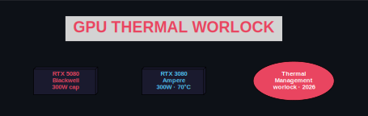
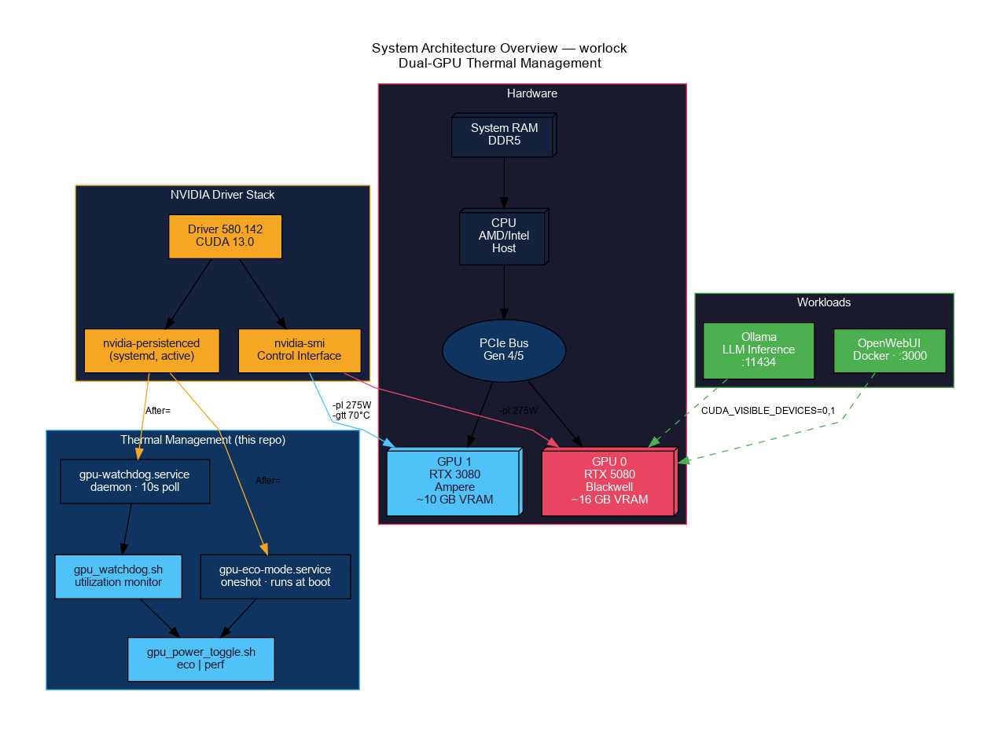
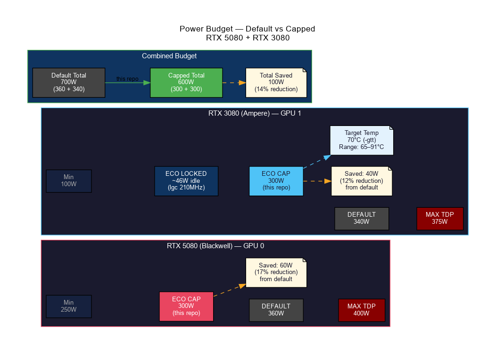
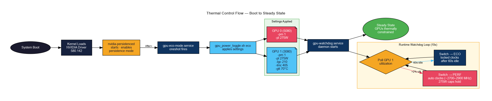
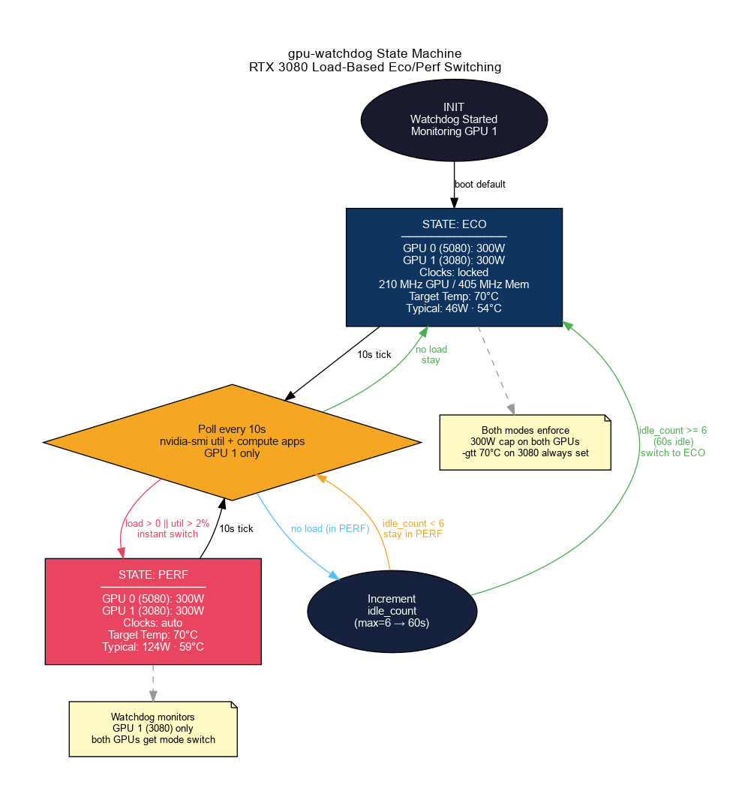
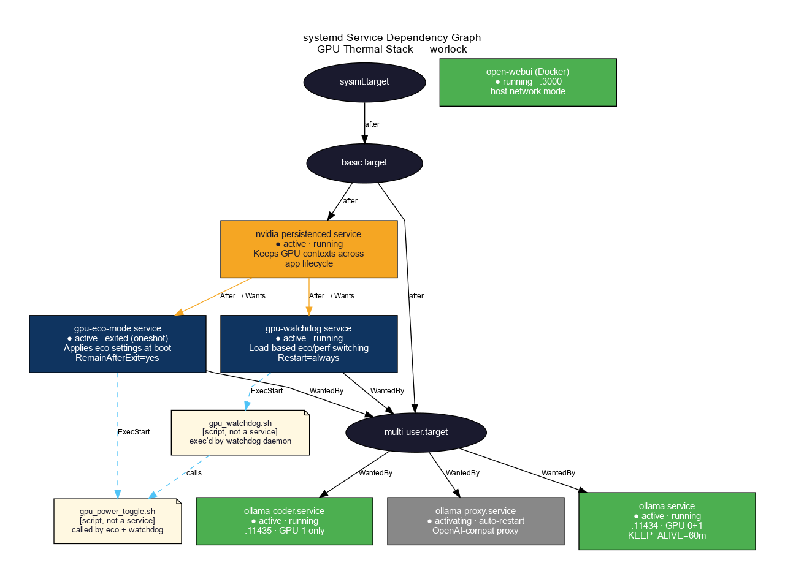

<p align="center">
  
</p>

<h1 align="center">gpu-thermal-worlock</h1>

<p align="center">
  Dual-GPU thermal management for the <strong>worlock</strong> machine.<br/>
  RTX 5080 (Blackwell) + RTX 3080 (Ampere) — power caps, target temperature, watchdog, and systemd persistence.
</p>

<p align="center">
  
  
  
  
  
  
  
  
</p>

---

## Overview

This repo documents and implements GPU thermal management for a dual-NVIDIA workstation running local LLM inference (Ollama) 24/7. The goals are:

- Keep both GPUs **below safe thermal thresholds** without manual intervention
- **Persist settings across reboots** via systemd
- **Automatically adapt** between low-power idle and higher-performance inference modes
- Accommodate the **architectural difference** between Blackwell (no `-gtt`) and Ampere (full `-gtt` support)

The implementation is written in **Python 3 + pynvml**, binding directly to `libnvidia-ml.so` — eliminating all `nvidia-smi` subprocess forks from the hot polling path.

---

## System Architecture

<p align="center">
  
</p>

> Full diagram: [SVG](docs/arch_system_overview.svg) · [DOT source](docs/arch_system_overview.dot)

---

## Hardware

| Slot | GPU | Architecture | VRAM | Default TDP | Power Range |
|------|-----|-------------|------|-------------|-------------|
| GPU 0 | NVIDIA RTX 5080 | Blackwell | ~16 GB GDDR7 | 360 W | 250–400 W |
| GPU 1 | NVIDIA RTX 3080 | Ampere | ~10 GB GDDR6X | 340 W | 100–375 W |

**Driver:** 580.142 · **CUDA:** 13.0 · **nvidia-persistenced:** enabled

---

## Thermal Configuration

| Setting | RTX 5080 (GPU 0) | RTX 3080 (GPU 1) |
|---------|-----------------|-----------------|
| Target Temp (`-gtt`) | **Not supported** (Blackwell) | **70°C** (range 65–91°C) |
| Power cap — eco mode | **300 W** | **300 W** |
| Power cap — perf mode | **300 W** | **300 W** |
| Clock control — eco | N/A | Locked: 210 MHz GPU / 405 MHz Mem |
| Clock control — perf | N/A | Auto |
| Max Operating Temp | N/A (T.Limit offsets) | 93°C |
| Slowdown threshold | T.Limit −2°C offset | 95°C |
| Shutdown threshold | T.Limit −5°C offset | 98°C |
| Margin to slowdown | N/A | **25°C** |

All tunable values live in **`gpu_thermal.toml`** — no code changes needed to adjust power limits or temperatures.

### Power Savings

<p align="center">
  
</p>

> Full diagram: [SVG](docs/arch_power_budget.svg) · [DOT source](docs/arch_power_budget.dot)

| GPU | Default | Capped | Saved |
|-----|---------|--------|-------|
| RTX 5080 | 360 W | 300 W | 60 W (17%) |
| RTX 3080 | 340 W | 300 W | 40 W (12%) |
| **Total** | **700 W** | **600 W** | **100 W (14%)** |

---

## Thermal Control Flow

<p align="center">
  
</p>

> Full diagram: [SVG](docs/arch_thermal_control_flow.svg) · [DOT source](docs/arch_thermal_control_flow.dot)

---

## Watchdog State Machine

The `gpu-watchdog` daemon monitors GPU 1 utilization every 10 seconds and automatically switches between eco and perf modes.

<p align="center">
  
</p>

> Full diagram: [SVG](docs/arch_watchdog_state_machine.svg) · [DOT source](docs/arch_watchdog_state_machine.dot)

| State | Trigger | 3080 Clocks | Both GPUs Power |
|-------|---------|------------|-----------------|
| **ECO** | Boot default / 60s idle | Locked 210 MHz | 300 W |
| **PERF** | Any load > 2% util | Auto | 300 W |

The 300W cap is enforced in **both** modes — the watchdog cannot lift it.

---

## systemd Service Dependencies

<p align="center">
  
</p>

> Full diagram: [SVG](docs/arch_service_dependencies.svg) · [DOT source](docs/arch_service_dependencies.dot)

| Service | Type | Role |
|---------|------|------|
| `nvidia-persistenced` | daemon | Keeps GPU driver state alive across app lifecycle |
| `gpu-eco-mode.service` | oneshot | Applies thermal settings at boot via Python CLI |
| `gpu-watchdog.service` | daemon | Load-based eco/perf switching via Python daemon |
| `ollama.service` | daemon | LLM inference on both GPUs |

---

## Implementation — Python 3 + pynvml

The codebase was refactored from bash scripts to a typed Python package backed by `nvidia-ml-py` (official NVIDIA pynvml bindings). This eliminates all `sudo nvidia-smi` subprocess forks from the polling loop.

### Why Python + pynvml

| Criterion | Python + pynvml | Bash scripts (before) |
|-----------|----------------|----------------------|
| GPU control | Direct `libnvidia-ml.so` binding | `sudo nvidia-smi` subprocess per call |
| Polling overhead | Zero process forks | 2 subprocess forks × 6/min |
| Error handling | Typed `NVMLError` exceptions | Silent failures |
| Config | `gpu_thermal.toml` | Hardcoded variables |
| Logging | Structured journal output | `echo` to stdout |
| Shutdown | SIGTERM → eco + clean exit | `kill` |
| Config reload | SIGHUP (no restart needed) | Service restart |
| Temp alerting | Built into poll loop | None |

### Package Structure

```
gpu-thermal-worlock/
├── gpu_thermal/
│   ├── __init__.py
│   ├── config.py        # Dataclass config loaded from gpu_thermal.toml
│   ├── nvml.py          # pynvml wrapper — all GPU queries and control ops
│   ├── modes.py         # eco/perf mode application logic
│   ├── cli.py           # Oneshot CLI (replaces gpu_power_toggle.sh)
│   └── watchdog.py      # State machine daemon (replaces gpu_watchdog.sh)
├── gpu_thermal.toml     # All tunable parameters — edit here, not in code
├── requirements.txt
├── pyproject.toml
├── scripts/legacy/      # Original bash scripts (archived)
├── systemd/
│   ├── gpu-eco-mode.service
│   └── gpu-watchdog.service
└── docs/                # Session logs, diagrams, how-to guides
```

### Configuration (`gpu_thermal.toml`)

```toml
[gpu.rtx5080]
id = 0
power_eco = 300
power_perf = 300
gtt_supported = false

[gpu.rtx3080]
id = 1
power_eco = 300
power_perf = 300
target_temp = 70
clock_mem_eco = 405
clock_gpu_eco = 210
gtt_supported = true

[watchdog]
poll_interval = 10
idle_threshold_pct = 2
idle_cycles_before_eco = 6

[alerting]
enabled = false
temp_warn_celsius = 80
webhook_url = ""
```

### Install

```bash
# Install dependencies (as root for systemd service use)
sudo pip3 install nvidia-ml-py sdnotify tomli

# Deploy service files
sudo cp systemd/gpu-eco-mode.service /etc/systemd/system/
sudo cp systemd/gpu-watchdog.service /etc/systemd/system/
sudo systemctl daemon-reload
sudo systemctl restart gpu-eco-mode.service gpu-watchdog.service
```

---

## Quick Reference

```bash
# Apply eco mode manually
sudo PYTHONPATH=/home/jeb/programs/gpu-thermal-worlock \
  python3 -m gpu_thermal.cli eco

# Apply perf mode manually
sudo PYTHONPATH=/home/jeb/programs/gpu-thermal-worlock \
  python3 -m gpu_thermal.cli perf

# Reload config without restarting watchdog (SIGHUP)
sudo systemctl kill -s HUP gpu-watchdog.service

# Reload boot-time thermal settings
sudo systemctl restart gpu-eco-mode.service

# Current temps, power, fan
nvidia-smi --query-gpu=index,name,temperature.gpu,power.draw,power.limit,fan.speed \
  --format=csv,noheader

# Watchdog journal (structured, per-GPU each tick)
journalctl -u gpu-watchdog.service -f --no-pager

# Service status
systemctl status gpu-eco-mode.service gpu-watchdog.service --no-pager

# Thermal thresholds
nvidia-smi -q | grep -E "Slowdown Temp|Shutdown Temp|Max Operating Temp|T\.Limit"
```

---

## Repository Layout

```
gpu-thermal-worlock/
├── README.md
├── gpu_thermal.toml                 # Config — all tunable values here
├── gpu_thermal/                     # Python package
│   ├── config.py
│   ├── nvml.py
│   ├── modes.py
│   ├── cli.py
│   └── watchdog.py
├── requirements.txt
├── pyproject.toml
├── scripts/legacy/                  # Archived bash scripts
│   ├── gpu_power_toggle.sh
│   └── gpu_watchdog.sh
├── systemd/
│   ├── gpu-eco-mode.service
│   └── gpu-watchdog.service
└── docs/
    ├── logo.{dot,png,svg}
    ├── arch_system_overview.{dot,png,svg}
    ├── arch_thermal_control_flow.{dot,png,svg}
    ├── arch_watchdog_state_machine.{dot,png,svg}
    ├── arch_power_budget.{dot,png,svg}
    ├── arch_service_dependencies.{dot,png,svg}
    ├── 2026-05-10_gpu_thermal_management.md
    ├── 2026-05-10_gpu_thermal_lessons_learned.{md,dot,png,svg}
    ├── 2026-05-10_gpu_thermal_howto.{md,dot,png,svg}
    └── 2026-05-10_gpu_thermal_future_directions.{md,dot,png,svg}
```

---

## Documentation

| Document | Description |
|----------|-------------|
| [Session Log](docs/2026-05-10_gpu_thermal_management.md) | Full session record with observed temps and verified state |
| [Lessons Learned](docs/2026-05-10_gpu_thermal_lessons_learned.md) | 6 key findings: arch differences, watchdog interference, persistence patterns |
| [How-To Guide](docs/2026-05-10_gpu_thermal_howto.md) | Command reference and decision workflow |
| [Future Directions](docs/2026-05-10_gpu_thermal_future_directions.md) | Roadmap: fan curves, per-workload profiles, alerting, Netdata integration |

---

## Key Findings

1. **Blackwell ≠ Ampere for thermal control** — RTX 5080 has no `-gtt` support; power capping is the only lever.
2. **Power cap is the universal fallback** — `-pl 300` held the 5080 in the 66–70°C range under sustained inference load.
3. **Watchdog can silently lift power limits** — perf mode previously reset caps; both modes now enforce 300W.
4. **Systemd oneshot is the right persistence pattern** — `After=nvidia-persistenced` + `RemainAfterExit=yes`.
5. **Always test with a service restart**, not just manual `nvidia-smi` — they are different verification paths.
6. **pynvml eliminates subprocess overhead** — the polling loop now makes zero child process forks; all GPU state is read directly from `libnvidia-ml.so`.

---

*Host: worlock · User: danindiana · Refactored: 2026-05-10 · Python 3.10 + nvidia-ml-py*
